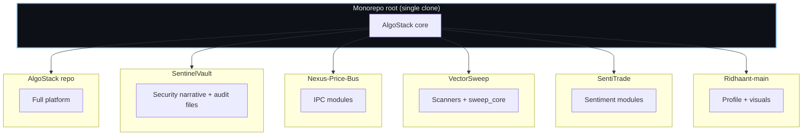

## **Hybrid monorepo — six GitHub-ready products**

*One codebase · six recruiter stories · clear boundaries for splitting or starring separately*

---

## How to read this layout

This directory is the **portfolio spine**: each subfolder matches a **separate GitHub repository** you can publish (or keep as documentation-only). The **live implementation** lives in the **monorepo root** and is **shared** — that is the **hybrid** model:

| Repo folder | Domain | Lives in root as |
|-------------|--------|-------------------|
| **[AlgoStack](./AlgoStack/)** | Full trading stack | Engines, Dash, autohealer, config, Docker, etc. |
| **[SentinelVault](./SentinelVault/)** | Security & secret hygiene | `secrets_audit.py`, auth patterns, CI ideas |
| **[Nexus-Price-Bus](./Nexus-Price-Bus/)** | Price IPC | `ipc_bus.py`, `price_service.py` |
| **[VectorSweep](./VectorSweep/)** | X sweeps & GPU research | `scanner*.py`, `sweep_core.py`, `gpu_sweep.py`, … |
| **[SentiTrade](./SentiTrade/)** | Sentiment & news | `sentiment_analyzer.py`, `news_dashboard.py` |
| **[Ridhaant-main](./Ridhaant-main/)** | Profile & brand | `ABOUT_ME.md`, `assets/readme/*` |

---

## Architecture: hybrid integration

**You do not duplicate business logic** unless you intentionally split into separate remotes later. Until then, **`repositories/*`** holds **publish instructions**, **architecture**, and **recruiter-facing** copy aligned with each GitHub repo name.

---

## Upload order (suggested)

1. **AlgoStack** — primary repo (largest); pin on profile.  
2. **VectorSweep** & **Nexus-Price-Bus** — show **performance** + **systems** depth.  
3. **SentiTrade** — **data + NLP + optional GenAI**.  
4. **SentinelVault** — **security maturity**.  
5. **Ridhaant-main** — GitHub profile README + static site.

Each folder’s **`PUBLISH.md`** lists **exact paths** to copy when creating a standalone remote.

---

**[← Monorepo home](../README.md)** · **[About me](../ABOUT_ME.md)**

